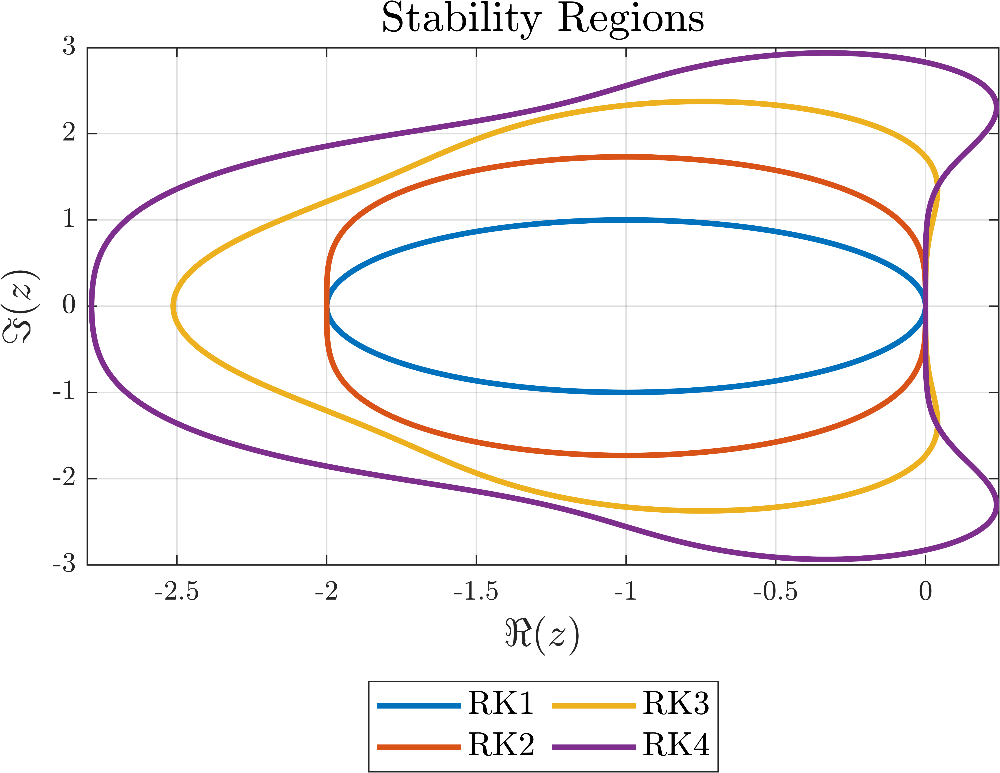

# General algorithm of the explicit Runge—Kutta method
Below I will describe an algorithm for solving IVP by any explicit Runge-Kutta method of any order for any dimensionality of the system, I have not seen such an implementation anywhere. 
The advantage of this algorithm is that the code will look much more compact, since you will not have to create cumbersome and long expressions to compute this or that expression for each individual IVP. 
All you have to do is fill in the Butcher tableau for the method you want the IVP to be solved by.

## Table of Contents

- [Explicit Runge—Kutta methods. Butcher tableau. Stability Function & Stability Region](#explicit-rungekutta-methods)
- [Description of the implemented algorithm](#description-of-the-implemented-algorithm)
- [Example](#example)
- [Notes](#notes)
  - [Input Arguments](#input-arguments)
  - [Output Arguments](#output-arguments)
  - [About Optimized Script](#about-optimized-script)
- [Planned Features](#planned-features)
- [References](#references)

## Explicit Runge—Kutta methods
Let an initial value problem be specified as follows:

$$ \dot{\mathbf{x}}=\mathbf{f}\left(t,\mathbf{x}\right),\quad t \in \left[t_0,t_\text{end}\right],\quad \mathbf{x}\left(t_0\right) = \mathbf{x}_0 \in \mathbb{R}^m, $$

where $\mathbf{x}=\left[x_1,\dots,x_m\right]^\mathbf{T},\quad
	\mathbf{f}\left(t,\mathbf{x}\right)=\left[f_1\left(t,x_1,\dots,x_n\right),\dots,f_m\left(t,x_1,\dots,x_n\right)\right]^\mathbf{T}.$
	
The $s$-stage Runge-Kutta method can be expressed as follows:

$$ \mathbf{x}_{n+1} = \mathbf{x}_n+\tau\sum\limits\_{i=1}^{s}b\_i\mathbf{k}\_{i}^{(n)}, $$

where 

$$ 
\begin{cases}
			\mathbf{k}\_{1}^{(n)} = \mathbf{f}\left(t_n,\mathbf{x}\_n\right),\\
			\vdots\\
			\mathbf{k}\_{i}^{(n)} = \mathbf{f}\left(t_n + c_i \tau, \mathbf{x}\_n + \tau\displaystyle\sum_{j=1}^{i-1} a_{i,j}\mathbf{k}_{j}^{(n)}\right),
\end{cases}
$$

$$ i=\overline{2,s}, $$

$\tau$ — time discretization step.

Method coefficients are conveniently set in the form of a **Butcher tableau**:

$$ 
\begin{array}{r|c}
			\mathbf{c} & \mathbf{A} \\
			\hline
			& \mathbf{b}^{\mathbf{T}}
		\end{array} \quad \Rightarrow
		\begin{array}{r|ccccc}
			0     &         &         &         & \\
			c_2   & a_{2,1}  &         &         & \\
			c_3   & a_{3,1}  & a_{3,2}  &         & \\
			\vdots& \vdots  & \vdots  & \ddots  & \\
			c_s   & a_{s,1}  & a_{s,2}  & \cdots  & a_{s,s-1} \\
			\hline
			& b_1     & b_2     & \cdots  & b_{s-1} & b_s
		\end{array},
$$

$$ \mathbf{c},\mathbf{b} \in \mathbb{R}^s,\quad \mathbf{A} \in \mathbb{R}^{s\times s}. $$

In the program implementation other elements of the matrix $\mathbf{A}$ are given by zeros, for example, the Butcher table for the classical method of order 4 is given in the program as follows:

$$ \begin{array}{r|cccc}
			0          &             &             &           & \\
			1/2     & 1/2        &             &           & \\
			1/2     & 0          & 1/2        &           & \\
			1           & 0          & 0           & 1        & \\
			\hline
			& 1/6      & 1/3      & 1/3      & 1/6    \\
\end{array} \quad \Rightarrow \quad \begin{array}{c|cccc}
				0   & 0   & 0   & 0   & 0\\
				1/2 & 1/2 & 0   & 0   & 0\\
				1/2 & 0   & 1/2 & 0   & 0\\
				1   & 0   & 0   & 1   & 0\\
				\hline
				& 1/6 & 1/3 & 1/3 & 1/6\\
		\end{array} $$
		
In the context of stability analysis of explicit Runge---Kutta methods, the stability region is defined as $\left\{z\in\mathbb{C}:\left|R\left(z\right)\right|\leq1\right\}$, where

$$
R\left(z\right) = 1 + z \mathbf{b}^\mathrm{T} \left(\mathbf{I} - z \mathbf{A}\right)^{-1} \mathbf{1} = \frac{\det\left(\mathbf{I} - z\mathbf{A} + z\mathbf{1}\mathbf{b}^\mathrm{T}\right)}{\det\left(\mathbf{I} - z\mathbf{A}\right)}
$$

is stability function. For explicit Runge—Kutta methods in which the number of stages equals the order (i.e. $s = p$, which is possible for orders 1 through 4), the order conditions force the stability function to match the Taylor (McLaurin) expansion of $\exp(z)$ up to and including the $z^p$ term. In other words, for these methods one obtains

$$
R(z) = \sum_{k=0}^{p} \frac{z^k}{k!}.
$$

The bounds of stability regions for such methods are presented below:

<p align="center">
  
</p>
		
## Description of the implemented algorithm
Of course, you can implement the algorithm described in the previous section as well, and it will work the same way as the algorithm I will describe below. 

So, the algorithm is based on the application of general matrix algebra:

$$ \mathbf{x}_{n+1} = \mathbf{x}_n+\tau\mathbf{K}^{(n)}\mathbf{b}.$$

To begin with, at each ([also take a look here](#AboutKmatrix)) iteration we need to initialize the matrix $\mathbf{K}^{(n)}$ of the corresponding size as a zero matrix and this matrix is interpreted as follows:

$$ \mathbf{K}^{(n)}\_{m\times s}=\left[\mathbf{k}_1^{(n)},\mathbf{k}_2^{(n)},\ldots,\mathbf{k}_s^{(n)}\right]=\mathbf{0}\_{m\times s}, $$

and the matrix $\mathbf{A}$:

$$ \mathbf{A}\_{s\times s} = 
		\begin{bmatrix}
			\mathbf{a}^{(1)\mathbf{T}}
			\\
			\mathbf{a}^{(2)\mathbf{T}}
			\\
			\vdots 
			\\
			\mathbf{a}^{(s)\mathbf{T}}
		\end{bmatrix}.
$$

Then the formulas for filling the matrix $\mathbf{K}^{(n)}$ can be represented as follows:

$$ \begin{cases}
			\mathbf{k}\_{1}^{(n)} = \mathbf{f}\left(t_n,\mathbf{x}_n\right),\\
			\vdots\\
			\mathbf{k}\_{i}^{(n)} = \mathbf{f}\left(t_n + c_i \tau, \mathbf{x}_n + \tau\mathbf{K}^{(n)}\_{m\times i-1}\mathbf{a}\_{i-1\times 1}^{(i)}\right),
	\end{cases}
$$

$$ i=\overline{2,s}.$$

## Example 
The _ExampleOfUse.mlx_ file shows the obtaining of the Tamari attractor

$$ \begin{cases}
			\frac{\mathrm{d}x}{\mathrm{d}t} =\left(x-\alpha y\right)\cos z-\beta y \sin z, \\
			\frac{\mathrm{d}y}{\mathrm{d}t} = \left(x+\gamma y\right)\sin z +\delta y\cos z, \\
			\frac{\mathrm{d}z}{\mathrm{d}t} = \varepsilon +\kappa z+\xi\arctan\left(\dfrac{1-\varsigma}{1-\omega}xy\right),
	\end{cases} 
$$

$$ \begin{bmatrix}
			\alpha\\
			\beta\\
			\gamma\\
			\delta\\
			\varepsilon\\
			\kappa\\
			\xi\\
			\varsigma\\
			\omega
		\end{bmatrix}=
		\begin{bmatrix}
		1.013\\
		-0.011\\
		0.02\\
		0.96\\
		0\\
		0.01\\
		1\\
		0.05\\
		0.05
		\end{bmatrix},$$

with initial conditions

$$\mathbf{x}_0 = [x_0,y_0,z_0]^\mathbf{T} = [1, 1, 1]^\mathbf{T},$$

using the 6th order Runge-Kutta-Butcher method.

<p align="center">
  
</p>

## Notes

### Input Arguments
- `c_vector`: vector of coefficients $\mathbf{c}$ of Butcher tableau for the selected method;
- `A_matrix`: matrix of coefficients $\mathbf{A}$ of Butcher tableau for the selected method;
- `b_vector`: vector of coefficients $\mathbf{b}$ of Butcher tableau for the selected method;
- `odefun`: functions to solve, specified as a function handle that defines the functions to be integrated;
- `tspan`: interval of integration, specified as a two-element vector;
- `tau`: time discretization step;
- `incond`: vector of initial conditions.

### Output Arguments
- `t`: vector of evaluation points used to perform the integration;
- `xsol`: solution matrix in which each row corresponds to a solution at the value returned in the corresponding row of `t`.

### About Optimized Script

The code from the _odeExplicitGeneral.m_ script shows a more illustrative integration procedure, for understanding from a theoretical point of view. The optimized version of this script _odeExplicitGeneral_optimized.m_ looks as follows:
```MATLAB
function [t, xsol] = odeExplicitGeneral_optimized(c_vector, A_matrix, b_vector, odefun, tspan, tau, incond)

s_stages = length(c_vector);
m = length(incond);

c_vector = reshape(c_vector, [s_stages 1]);
b_vector = reshape(b_vector, [s_stages 1]);
incond = reshape(incond, [m 1]);

t = (tspan(1):tau :tspan(2))';
xsol = zeros(length(incond), length(t));
xsol(:, 1) = incond(:);
K_matrix = zeros(m, s_stages);

for n = 1:length(t)-1
    K_matrix(:, 1) = odefun(t(n), xsol(:, n));   
        for i = 2:s_stages
            K_matrix(:, i) = odefun(t(n) + tau * c_vector(i), xsol(:, n) + tau * K_matrix(:, 1:i-1) * A_matrix(i, 1:i-1)');
        end
    xsol(:, n+1) = xsol(:, n) + tau * K_matrix * b_vector;
end
xsol = xsol';
end
```
With only 23 lines for such a powerful instrument, it looks awesome, doesn't it?

<span id="AboutKmatrix"></span> Here no unnecessary variables are created, and the `K_matrix` is initialized as zero matrix only once, because the algorithm allows not to fill it with zeros at each iteration, but just to overwrite the columns at this iteration without using the columns with coeficients from the previous one: 
```MATLAB
K_matrix(:, i) = odefun(t(n) + tau * c_vector(i), xsol(:, n) + tau * K_matrix(:, 1:i-1) * A_matrix(i, 1:i-1)')
```


## References
1. Butcher, J. (2016). Numerical methods for ordinary differential equations. https://doi.org/10.1002/9781119121534
2. Tamari, B. (1997). Conservation and symmetry laws and stabilization programs in economics. https://www.bentamari.com/PicturesEcometry/Book3-Conservation.pdf
