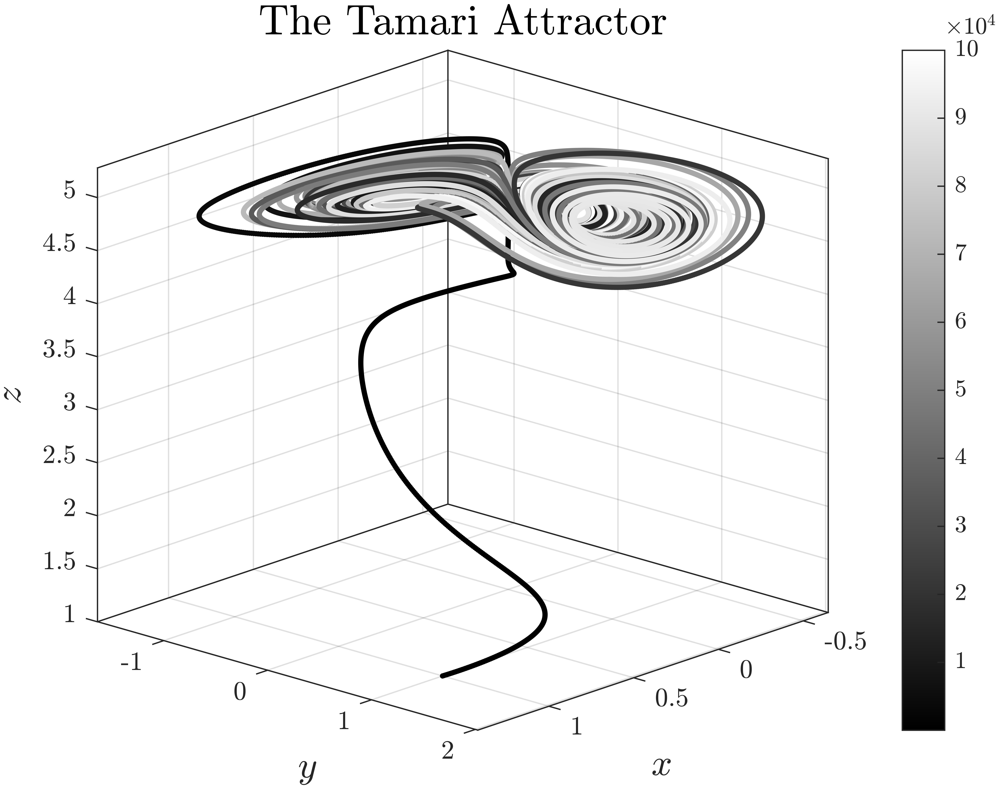

# General Algorithm of The Explicit Runge—Kutta Method
This repository contains an algorithm for solving initial value problems (IVPs) using any explicit Runge—Kutta method of any order and for systems of arbitrary dimensionality. 
Unlike conventional implementations, this approach allows for a more compact and flexible code structure by eliminating the need to manually derive and write out lengthy expressions for each specific IVP. 
Instead, the user simply provides the Butcher tableau corresponding to the desired Runge—Kutta method, making the implementation both general and efficient.

## Table of Contents

- [Explicit Runge—Kutta methods. Butcher tableau. Stability Function & Stability Region](#explicit-rungekutta-methods)
- [Description of the implemented algorithm](#description-of-the-implemented-algorithm)
- [Example](#example)
- [Notes](#notes)
  - [Syntax](#syntax)
  - [Input Arguments](#input-arguments)
  - [Output Arguments](#output-arguments)
- [References](#references)

## Explicit Runge—Kutta methods
Let an initial value problem be specified as follows:
```math
\dot{\mathbf{z}}\left(t\right)=\mathbf{f}\left(t,\mathbf{z}\right),\quad t \in \left[t_0,t_\text{end}\right],\quad \mathbf{z}\left(t_0\right) = \mathbf{z}_0, 
```
where $`\mathbf{z}\left(t\right): \mathbb{R}\mapsto\mathbb{R}^m, \mathbf{f}\left(t,\mathbf{z}\right):\mathbb{R}\times\mathbb{R}^m\mapsto\mathbb{R}^m.`$
	
The $s$-stage Runge-Kutta method can be expressed as follows:
```math
\mathbf{z}_{n+1} = \mathbf{z}_n+\tau\sum\limits_{i=1}^{s}b_i\mathbf{k}_{i}^{(n)},
```
where for $`i=\overline{2,s}`$
```math
\begin{cases}
			\mathbf{k}_{1}^{(n)} = \mathbf{f}\left(t_n,\mathbf{z}_n\right),\\
			\vdots\\
			\mathbf{k}_{i}^{(n)} = \mathbf{f}\left(t_n + c_i \tau, \mathbf{z}_n + \tau\displaystyle\sum_{j=1}^{i-1} a_{i,j}\mathbf{k}_{j}^{(n)}\right),
\end{cases}
```
$`\tau`$ — time discretization step.

Method coefficients are conveniently set in the form of a **Butcher tableau**:

$$
\begin{array}{r|c}
    \mathbf{c} & \mathbf{A} \\
    \hline
    & \mathbf{b}^{\top}
\end{array} \quad \Rightarrow \quad
\begin{array}{r|ccccc}
    0      &          &          &          & \\
    c_2    & a_{2,1}  &          &          & \\
    c_3    & a_{3,1}  & a_{3,2}  &          & \\
    \vdots & \vdots   & \vdots   & \ddots   & \\
    c_s    & a_{s,1}  & a_{s,2}  & \cdots   & a_{s,s-1} \\
    \hline
    & b_1      & b_2      & \cdots   & b_{s-1} & b_s
\end{array}
$$

where $`\mathbf{c},\mathbf{b} \in \mathbb{R}^s, \mathbf{A} \in \mathbb{R}^{s\times s}.`$

In the program implementation other elements of the matrix $\mathbf{A}$ are given by zeros, for example, the Butcher table for the classical method of order 4 is given in the program as follows:

$$
\begin{array}{r|cccc}
			0          &             &             &           & \\
			1/2     & 1/2        &             &           & \\
			1/2     & 0          & 1/2        &           & \\
			1           & 0          & 0           & 1        & \\
			\hline
			& 1/6      & 1/3      & 1/3      & 1/6    \\
\end{array} \quad \Rightarrow \quad \begin{array}{c|cccc}
				0   & 0   & 0   & 0   & 0\\
				1/2 & 1/2 & 0   & 0   & 0\\
				1/2 & 0   & 1/2 & 0   & 0\\
				1   & 0   & 0   & 1   & 0\\
				\hline
				& 1/6 & 1/3 & 1/3 & 1/6\\
		\end{array} 
$$

In the context of stability analysis of explicit Runge—Kutta methods, the stability region is defined as $\left\\{z\in\mathbb{C}:\left|R\left(z\right)\right|\leq1\right\\}$, where
```math
R\left(z\right) = 1 + z \mathbf{b}^\top \left(\mathbf{I} - z \mathbf{A}\right)^{-1} \mathbf{1} = \frac{\det\left(\mathbf{I} - z\mathbf{A} + z\mathbf{1}\mathbf{b}^\top\right)}{\det\left(\mathbf{I} - z\mathbf{A}\right)}
```
is stability function. For explicit Runge—Kutta methods in which the number of stages equals the order (i.e. $s = p$, which is possible for orders 1 through 4), the order conditions force the stability function to match the Taylor (Maclaurin) expansion of $\exp(z)$ up to and including the $z^p$ term. In other words, for these methods one obtains
```math
R\left(z\right) = \sum_{k=0}^{p} \frac{z^k}{k!}.
```
Stability regions for such methods are presented below:

<p align="center">
  
</p>

For the method with $s=6, p=5$ used in the [odeRKB5.m](odeExplicitSolvers/odeRKB5.m) script, the stability function is
```math
R\left(z\right)= 1 + z + \frac{z^2}{2} + \frac{z^3}{6} + \frac{z^4}{24} + \frac{z^5}{120} + \frac{z^6}{1280},
```

## Description of the implemented algorithm
Of course, you can implement the algorithm described in the previous section as well, and it will work the same way as the algorithm I will describe below. 

So, the algorithm is based on the application of general matrix algebra:
```math
\mathbf{z}_{n+1} = \mathbf{z}_n+\tau\mathbf{K}^{(n)}\mathbf{b}.
```
To begin with, we need to initialize the matrix $`\mathbf{K}^{(n)}`$ of the corresponding size as a zero matrix and this matrix is interpreted as follows:
```math
\mathbf{K}^{(n)}_{m\times s}=\left[\mathbf{k}_1^{(n)},\mathbf{k}_2^{(n)},\ldots,\mathbf{k}_s^{(n)}\right]=\mathbf{0}_{m\times s}, 
```
and the matrix $`\mathbf{A}`$:
```math
\mathbf{A}_{s\times s} = 
		\begin{bmatrix}
			\mathbf{a}^{(1)\top}
			\\
			\mathbf{a}^{(2)\top}
			\\
			\vdots 
			\\
			\mathbf{a}^{(s)\top}
		\end{bmatrix}.
```

Then the formulas for filling the matrix $`\mathbf{K}^{(n)}`$ can be represented as follows:
```math
\begin{cases}
			\mathbf{k}_{1}^{(n)} = \mathbf{f}\left(t_n,\mathbf{z}_n\right),\\
			\vdots\\
			\mathbf{k}_{i}^{(n)} = \mathbf{f}\left(t_n + c_i \tau, \mathbf{z}_n + \tau\mathbf{K}^{(n)}_{m\times i-1}\mathbf{a}_{i-1\times 1}^{(i)}\right),
	\end{cases}
```

## Example 
The [ExampleOfUse.mlx](ExampleOfUse/ExampleOfUse.pdf) file shows the obtaining of the Tamari attractor

```math
\begin{cases}
			\dfrac{\mathrm{d}x}{\mathrm{d}t} =\left(x-\alpha y\right)\cos z-\beta y \sin z, \\
			\dfrac{\mathrm{d}y}{\mathrm{d}t} = \left(x+\gamma y\right)\sin z +\delta y\cos z, \\
			\dfrac{\mathrm{d}z}{\mathrm{d}t} = \varepsilon +\kappa z+\xi\arctan\left(\dfrac{1-\varsigma}{1-\omega}xy\right),
\end{cases} 
```

```math
\begin{bmatrix}
			\alpha\\
			\beta\\
			\gamma\\
			\delta\\
			\varepsilon\\
			\kappa\\
			\xi\\
			\varsigma\\
			\omega
		\end{bmatrix}=
		\begin{bmatrix}
		1.013\\
		-0.011\\
		0.02\\
		0.96\\
		0\\
		0.01\\
		1\\
		0.05\\
		0.05
		\end{bmatrix}
```
with initial conditions
```math
\mathbf{z}_0 = [z_0,y_0,z_0]^\top = [1, 1, 1]^\top
```
using the 6th order Runge-Kutta-Butcher method.

<p align="center">
  
</p>

## Notes

### Syntax
`[t, zsol, dzdt_eval] = odeExplicitGeneral(c_vector, A_matrix, b_vector, odefun, tspan, tau, incond)`

### Input Arguments
- `c_vector`: vector of coefficients $\mathbf{c}$ of Butcher tableau for the selected method;
- `A_matrix`: matrix of coefficients $\mathbf{A}$ of Butcher tableau for the selected method;
- `b_vector`: vector of coefficients $\mathbf{b}$ of Butcher tableau for the selected method;
- `odefun`: function handle defining the right-hand sides of the differential equations $`\dot{\mathbf{z}}\left(t\right)=\mathbf{f}\left(t,\mathbf{z}\right)`$. It must accept arguments (`t`, `z`) and return a column vector of derivatives;
- `tspan`: interval of integration, specified as a two-element vector;
- `tau`: time discretization step;
- `incond`: vector of initial conditions.

### Output Arguments
- `t`: vector of evaluation points used to perform the integration;
- `zsol`: solution matrix in which each row corresponds to a solution at the value returned in the corresponding row of `t`;
- `dzdt_eval`: matrix of derivatives $`\dot{\mathbf{z}}\left(t\right)`$ evaluated at the times in `t`; each row contains the derivative of the solution corresponding to the matching row of `t`.

## References
1. Butcher, J. (2016). Numerical methods for ordinary differential equations. https://doi.org/10.1002/9781119121534
2. Tamari, B. (1997). Conservation and symmetry laws and stabilization programs in economics. https://www.bentamari.com/PicturesEcometry/Book3-Conservation.pdf
